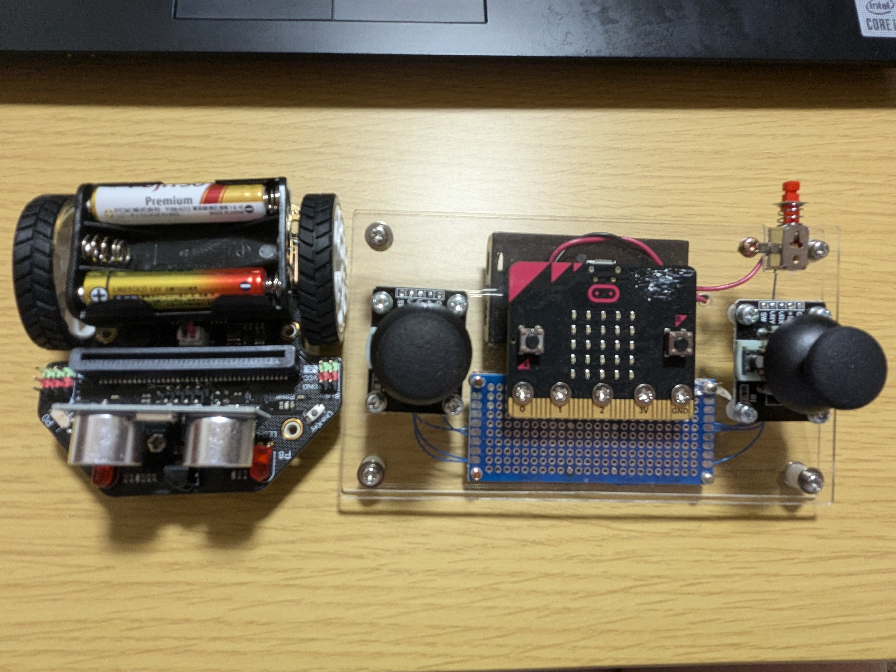

### joystick



```python
# joyRecV2
# Maqueenを無線で操作するプログラム
# modules: Maqueen, Neopixel
# 右右LED点灯

# 初期設定（最初だけ）
BLUE = 0
GREEN = 0
RED = 0
Cmd = 0
Rmd = 0
Lmd = 0
無線番号 = 23
radio.set_group(無線番号)
basic.show_number(無線番号)
item = neopixel.create(DigitalPin.P15, 4, NeoPixelMode.RGB)

def on_received_value_deprecated(name, value):
    global Lmd, Rmd, Cmd
    if name == "L":
        if value > 50:
            Lmd = 1
            led.plot(0, 4)
            led.unplot(0, 3)
            led.unplot(0, 2)
            led.unplot(0, 1)
            led.unplot(0, 0)
        elif value < -50:
            Lmd = 2
            led.plot(0, 0)
            led.unplot(0, 1)
            led.unplot(0, 2)
            led.unplot(0, 3)
            led.unplot(0, 4)
        else:
            Lmd = 0
            led.unplot(0, 0)
            led.unplot(0, 1)
            led.plot(0, 2)
            led.unplot(0, 3)
            led.unplot(0, 4)
    if name == "R":
        if value > 50:
            Rmd = 1
            led.plot(4, 4)
            led.unplot(4, 3)
            led.unplot(4, 2)
            led.unplot(4, 1)
            led.unplot(4, 0)
        elif value < -50:
            Rmd = 2
            led.plot(4, 0)
            led.unplot(4, 1)
            led.unplot(4, 2)
            led.unplot(4, 3)
            led.unplot(4, 4)
        else:
            Rmd = 0
            led.unplot(4, 0)
            led.unplot(4, 1)
            led.plot(4, 2)
            led.unplot(4, 3)
            led.unplot(4, 4)
    if name == "r":
        if value > 50:
            Cmd = 1
            led.plot(1, 2)
            led.unplot(2, 2)
            led.unplot(3, 2)
        elif value < -50:
            Cmd = 1
            led.plot(3, 2)
            led.unplot(2, 2)
            led.unplot(1, 2)
        else:
            led.unplot(1, 2)
            led.plot(2, 2)
            led.unplot(3, 2)
    if Rmd == 1:
        maqueen.motor_run(maqueen.Motors.M2, maqueen.Dir.CCW, 255)
    elif Rmd == 2:
        maqueen.motor_run(maqueen.Motors.M2, maqueen.Dir.CW, 255)
    else:
        maqueen.motor_run(maqueen.Motors.M2, maqueen.Dir.CW, 0)
    if Lmd == 1:
        maqueen.motor_run(maqueen.Motors.M1, maqueen.Dir.CCW, 255)
    elif Lmd == 2:
        maqueen.motor_run(maqueen.Motors.M1, maqueen.Dir.CW, 255)
    else:
        maqueen.motor_run(maqueen.Motors.M1, maqueen.Dir.CW, 0)
radio.on_received_value_deprecated(on_received_value_deprecated)


def on_forever():
    global RED, GREEN, BLUE, Cmd
    if Cmd == 1:
        RED = 0
        GREEN = 0
        BLUE = 255
        for index in range(255):
            RED += 1
            BLUE += -1
            item.show_color(neopixel.rgb(RED, GREEN, BLUE))
            basic.pause(1)
        for index2 in range(255):
            GREEN += 1
            RED += -1
            item.show_color(neopixel.rgb(RED, GREEN, BLUE))
            basic.pause(1)
        for index3 in range(255):
            BLUE += 1
            GREEN += -1
            item.show_color(neopixel.rgb(RED, GREEN, BLUE))
            basic.pause(1)
        RED = 0
        BLUE = 0
        GREEN = 0
        item.show_color(neopixel.rgb(RED, GREEN, BLUE))
        Cmd = 0
basic.forever(on_forever)


```

```python
# joySendV2
# Maqueenを無線で操作するプログラム(送信側)
# modules: なし
#　左（上下）、右（上下）　

VOL = 0
CHD = 23
radio.set_group(CHD)
basic.show_number(CHD)

# ずっとブロック(While True)
def on_forever():
    global VOL
    pins.digital_write_pin(DigitalPin.P2, 1)
    VOL = Math.map(pins.analog_read_pin(AnalogReadWritePin.P0),
        0,
        1023,
        -100,
        100)
    radio.send_value("L", VOL)
    if VOL > 50:
        led.plot(0, 4)
        led.unplot(0, 3)
        led.unplot(0, 2)
        led.unplot(0, 1)
        led.unplot(0, 0)
    elif VOL < -50:
        led.plot(0, 0)
        led.unplot(0, 1)
        led.unplot(0, 2)
        led.unplot(0, 3)
        led.unplot(0, 4)
    else:
        led.unplot(0, 0)
        led.unplot(0, 1)
        led.plot(0, 2)
        led.unplot(0, 3)
        led.unplot(0, 4)
    VOL = Math.map(pins.analog_read_pin(AnalogReadWritePin.P1),
        0,
        1023,
        -100,
        100)
    radio.send_value("D", VOL)
    if VOL > 50:
        led.plot(1, 1)
        led.unplot(2, 1)
        led.unplot(3, 1)
    elif VOL < -50:
        led.unplot(1, 1)
        led.unplot(2, 1)
        led.plot(3, 1)
    else:
        led.unplot(1, 1)
        led.plot(2, 1)
        led.unplot(3, 1)
    pins.digital_write_pin(DigitalPin.P2, 0)
    VOL = Math.map(pins.analog_read_pin(AnalogReadWritePin.P0),
        0,
        1023,
        -100,
        100)
    radio.send_value("R", VOL)
    if VOL > 50:
        led.plot(4, 4)
        led.unplot(4, 3)
        led.unplot(4, 2)
        led.unplot(4, 1)
        led.unplot(4, 0)
    elif VOL < -50:
        led.plot(4, 0)
        led.unplot(4, 1)
        led.unplot(4, 2)
        led.unplot(4, 3)
        led.unplot(4, 4)
    else:
        led.unplot(4, 0)
        led.unplot(4, 1)
        led.plot(4, 2)
        led.unplot(4, 3)
        led.unplot(4, 4)
    VOL = Math.map(pins.analog_read_pin(AnalogReadWritePin.P1),
        0,
        1023,
        -100,
        100)
    radio.send_value("r", VOL)
    if VOL > 50:
        led.plot(1, 3)
        led.unplot(2, 3)
        led.unplot(3, 3)
    elif VOL < -50:
        led.plot(3, 3)
        led.unplot(2, 3)
        led.unplot(1, 3)
    else:
        led.unplot(1, 3)
        led.plot(2, 3)
        led.unplot(3, 3)
basic.forever(on_forever)

```

