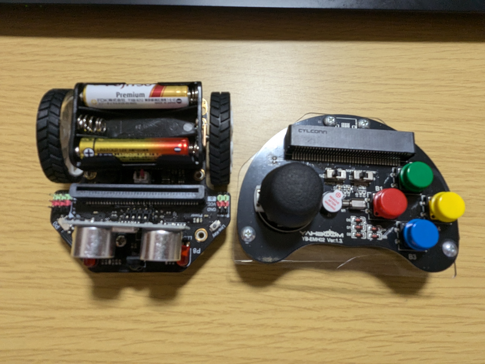

### joystick Recive




```python
# joyRecV25
# Maqueenを無線で操作するプログラム
# modules: Maqueen, Neopixel

# 初期設定（最初だけ）
BLUE = 0
GREEN = 0
RED = 0
Cmd = 0
Hmd = 0
Vmd = 0
無線番号 = 25
radio.set_group(無線番号)
basic.show_number(無線番号)
item = neopixel.create(DigitalPin.P15, 4, NeoPixelMode.RGB)


# 無線で受信したときの処理
def on_received_value_deprecated(name, value):
    global Vmd, Hmd, Cmd
    if name == "V":
        led.unplot(0, 4)
        led.unplot(0, 3)
        led.unplot(0, 2)
        led.unplot(0, 1)
        led.unplot(0, 0)
        if value > 50:
            Vmd = 1
            led.plot(0, 4)
        elif value < -50:
            Vmd = 2
            led.plot(0, 0)
        else:
            Vmd = 0
            led.plot(0, 2)
    if name == "H":
        led.unplot(1, 0)
        led.unplot(2, 0)
        led.unplot(3, 0)
        if value > 50:
            Hmd = 1
            led.plot(1, 0)
        elif value < -50:
            Hmd = 2
            led.plot(3, 0)
        else:
            Hmd = 0
            led.plot(2, 0)
    led.unplot(2, 3)
    led.unplot(3, 2)
    led.unplot(3, 4)
    led.unplot(4, 3)
    if name == "S" and value == 1:
        Cmd = 1
        led.plot(2, 3)
    if name == "S" and value == 2:
        Cmd = 2
        led.plot(3, 2)
    if name == "S" and value == 4:
        Cmd = 4
        led.plot(3, 4)
    if name == "S" and value == 8:
        Cmd = 8
        led.plot(4, 3)
    if Hmd == 1:
        if Cmd == 1:
            maqueen.motor_run(maqueen.Motors.M2, maqueen.Dir.CW, 255)
            maqueen.motor_run(maqueen.Motors.M1, maqueen.Dir.CCW, 255)
        else:
            maqueen.motor_run(maqueen.Motors.M2, maqueen.Dir.CW, 255)
            maqueen.motor_run(maqueen.Motors.M1, maqueen.Dir.CW, 0)
    elif Hmd == 2:
        if Cmd == 8:
            maqueen.motor_run(maqueen.Motors.M2, maqueen.Dir.CCW, 255)
            maqueen.motor_run(maqueen.Motors.M1, maqueen.Dir.CW, 255)
        else:
            maqueen.motor_run(maqueen.Motors.M2, maqueen.Dir.CW, 0)
            maqueen.motor_run(maqueen.Motors.M1, maqueen.Dir.CW, 255)
    else:
        if Vmd == 1:
            maqueen.motor_run(maqueen.Motors.M2, maqueen.Dir.CCW, 255)
            maqueen.motor_run(maqueen.Motors.M1, maqueen.Dir.CCW, 255)
        elif Vmd == 2:
            maqueen.motor_run(maqueen.Motors.M2, maqueen.Dir.CW, 255)
            maqueen.motor_run(maqueen.Motors.M1, maqueen.Dir.CW, 255)
        else:
            maqueen.motor_run(maqueen.Motors.M2, maqueen.Dir.CW, 0)
            maqueen.motor_run(maqueen.Motors.M1, maqueen.Dir.CW, 0)
    if Cmd != 2:
        Cmd = 0
radio.on_received_value_deprecated(on_received_value_deprecated)

# ずっとブロック(While True)
def on_forever():
    global RED, GREEN, BLUE, Cmd
    if Cmd == 2:
        RED = 0
        GREEN = 0
        BLUE = 255
        for index in range(255):
            RED += 1
            BLUE += -1
            item.show_color(neopixel.rgb(RED, GREEN, BLUE))
            basic.pause(1)
        for index2 in range(255):
            GREEN += 1
            RED += -1
            item.show_color(neopixel.rgb(RED, GREEN, BLUE))
            basic.pause(1)
        for index3 in range(255):
            BLUE += 1
            GREEN += -1
            item.show_color(neopixel.rgb(RED, GREEN, BLUE))
            basic.pause(1)
        RED = 0
        BLUE = 0
        GREEN = 0
        item.show_color(neopixel.rgb(RED, GREEN, BLUE))
        Cmd = 0
basic.forever(on_forever)

```

```python
# joySendV25
# Maqueenを無線で操作するプログラム(送信側)
# modules: 

VOL = 0
CHD = 25
radio.set_group(CHD)
basic.show_number(CHD)
SW = 0
# 使う端子を接続
pins.set_pull(DigitalPin.P13, PinPullMode.PULL_UP)
pins.set_pull(DigitalPin.P14, PinPullMode.PULL_UP)
pins.set_pull(DigitalPin.P15, PinPullMode.PULL_UP)
pins.set_pull(DigitalPin.P16, PinPullMode.PULL_UP)

# ずっと
# Joystickの上下、左右
def on_forever():
    global VOL, SW
    # 読み込んだアナログ値を0から1023を-127から127に変換
    VOL = Math.map(pins.analog_read_pin(AnalogReadWritePin.P1),
        0,
        1023,
        -127,
        127)
    # 垂直方向
    radio.send_value("V", VOL)
    if VOL > 50:
        led.unplot(0, 0)
        led.unplot(0, 1)
        led.unplot(0, 2)
        led.unplot(0, 3)
        led.plot(0, 4)
    elif VOL < -50:
        led.plot(0, 0)
        led.unplot(0, 1)
        led.unplot(0, 2)
        led.unplot(0, 3)
        led.unplot(0, 4)
    else:
        led.unplot(0, 0)
        led.unplot(0, 1)
        led.plot(0, 2)
        led.unplot(0, 3)
        led.unplot(0, 4)
    # 水平方向
    VOL = Math.map(pins.analog_read_pin(AnalogReadWritePin.P2),
        0,
        1023,
        -127,
        127)
    radio.send_value("H", VOL)
    if VOL > 50:
        led.plot(1, 0)
        led.unplot(2, 0)
        led.unplot(3, 0)
    elif VOL < -50:
        led.unplot(1, 0)
        led.unplot(2, 0)
        led.plot(3, 0)
    else:
        led.unplot(1, 0)
        led.plot(2, 0)
        led.unplot(3, 0)
    led.unplot(3, 2)
    led.unplot(2, 3)
    led.unplot(4, 3)
    led.unplot(3, 4)
    SW = 0
    if 0 == pins.digital_read_pin(DigitalPin.P13):
        led.unplot(3, 2)
        led.plot(2, 3)
        led.unplot(4, 3)
        led.unplot(3, 4)
        SW = SW + 1
    if 0 == pins.digital_read_pin(DigitalPin.P14):
        led.plot(3, 2)
        led.unplot(2, 3)
        led.unplot(4, 3)
        led.unplot(3, 4)
        SW = SW + 2
    if 0 == pins.digital_read_pin(DigitalPin.P15):
        led.unplot(3, 2)
        led.unplot(2, 3)
        led.unplot(4, 3)
        led.plot(3, 4)
        SW = SW + 4
    if 0 == pins.digital_read_pin(DigitalPin.P16):
        led.unplot(3, 2)
        led.unplot(2, 3)
        led.plot(4, 3)
        led.unplot(3, 4)
        SW = SW + 8
    # SWの情報
    radio.send_value("S", SW)
basic.forever(on_forever)

```

